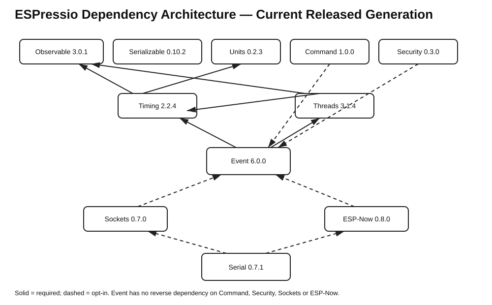

# ESPressio Dependency Chart — Current Released Generation



This document records the former released generation while the `feature/53-radio-provider` working branch is validated against the current dependency branches.

## Released generation

```text
Observable    3.0.2
Serializable  0.11.3
Units         0.2.7
Timing        2.2.8
Threads       3.1.7
Event         6.0.3
Command       1.0.3
Security      0.4.2
Persistence   0.3.2
Sockets       0.7.3
ESP-Now       0.8.3
WiFi          0.2.0
Serial        0.8.1
```

## ESP-Now dependency position

```text
ESP-Now feature/53-radio-provider
    -> System main
    -> Radio main
    -> Task main
    -> Units main
    -> Timing main
    -> Observable main
    -> Threads main

ESP-Now optional integrations
    - - -> Event main
    - - -> Command main
    - - -> Security main
    - - -> WiFi main
```

The normal `ESPressio_ESPNow.hpp` umbrella remains integration-neutral. ESP-Now owns its concrete Event transport and lifecycle Event bridge, preserving one-way dependency direction.

## Dependency-direction invariants

```text
ESP-Now - - -> Event
ESP-Now - - -> Command
ESP-Now - - -> Security

Event    -> ESP-Now  NONE
Command  -> ESP-Now  NONE
Security -> ESP-Now  NONE
```

The old release-generation numbers above are historical context only. Current dependencies are consumed from `main`; the ESP-Now self-reference remains on the live `feature/53-radio-provider` branch where branch-specific validation requires it.
